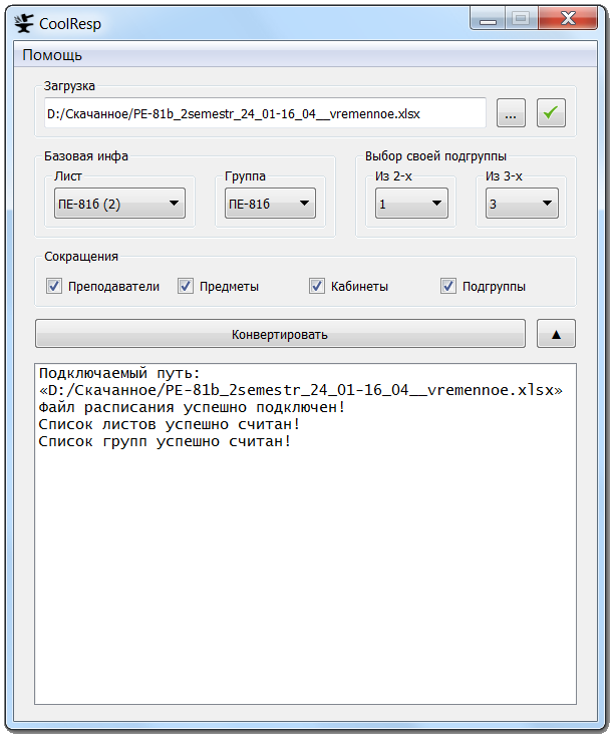

# CoolResp или "расписание может быть удобным".
Мечтают ли андроиды об электроовцах? Мечтаете ли вы об удобном расписании? 
Если вы больше студент чем андроид, то воплотить мечту поможет CoolResp - портативный конвертер расписания.  

  

----------

## Навигация
1. [О программе](#О-программе)
2. [Приступая к работе](#Приступая-к-работе)
3. [Используемые библиотеки](#Используемые-библиотеки)
4. [Навигация по интерфейсу](#Навигация-по-интерфейсу)
5. [Известные баги](#Известные-баги)
6. [Процесс обработки расписания](#Процесс-обработки-расписания)  

----------

# О программе
**CoolResp** - портативный конвертер расписания, чья основная задача заключается в преобразовании
 нечитаемого официального расписания в сравнительно понятный excel документ.
  Для этого, программа считывает изначальный файл, парсит его в миниатюрный датасет,
  а затем форматно записывает его в новую таблицу.  
  
  В корневой папке Tests можно наглядно ознакомиться с результатами преобразования:  
  - /Tests/Datasets хранит исходные excel таблицы с расписаниями;  
  - /Tests/Jsons хранит результаты парсинга и анализа - их изучение полезно для отладки форматировщика;  
  - /Tests/Results хранит отформатированные таблицы с переработанным расписанием.

P.S Если кто-нибудь обнаружит баги в этих, или же своих, результатах - сообщите, пожалуйста, об этом мне.
  
Автор: Мирославский И.С ([DK905](https://vk.com/dk905)).  

----------

## Приступая к работе
Начать работу с CoolResp можно двумя способами:  
1) Скачать и запустить исполняемый файл `CoolResp.exe`, который откроет интерфейс конвертера. Подробнее об интерфейсе можно прочесть [тут](#Навигация-по-интерфейсу);  
2) Загрузить из репозитория папку исходных кодов проекта `CoolRespProject` и  инициализатор `main.py`, установить все [необходимые зависимости](#Используемые-библиотеки), после чего начать работу с инициализатором - он запустит [интерфейс проекта](#Навигация-по-интерфейсу).  

----------

## Используемые библиотеки
Проект полностью написан на `python 3.8.3` и представлен модульной системой. Код проекта написан в процедурном стиле, за исключением интерфейса - он в ООП.  

### Стандартные библиотеки python

|   Модуль   | Версия |                   Назначение                  |
| :--------: | :----: | :-------------------------------------------: |
| datetime   | 3.8.3  | Хранит даты расписания в формате объектов дат |
| re         | 2.2.1  | Регулярные выражения, на них построен парсинг |
| sys        | 3.8.3  | Для завершения процесса приложения            |
| webbrowser | 3.8.3  | Для перехода по ссылке на гит (пункт в меню)  |

### Внешние библиотеки python

|  Модуль   | Версия |                    Назначение                     |
| :-------: | :----: | :-----------------------------------------------: |
| openpyxl  | 3.0.4  | Форматирование расписание, сохранение его в .xlsx |
| pyexcel   | 0.6.2  | Открытие расписания как из .xls, так и из .xlsx   |
| pyperclip | 1.8.0  | Копирование лога в буфер обмена                   |
| PyQt5     | 5.15.0 | Интерфейс                                         |

### Основные модули проекта
|     Элемент             |                              Назначение                                      |
| :---------------------: | :--------------------------------------------------------------------------: |
| main                    | Основное приложение, подгружает в себя модули и макет интерфейса             |
| main_gui.py             | Код макета интерфейса ПК версии                                              |
| CR_analyze.py           | Модуль анализа                                                               |
| CR_dataset.py           | Модуль с константами вроде списка сокращений типов пар                       |
| CR_jsoner.py            | Модуль для записи БД парсинга и анализа в json файл (будущее)                |
| CR_parser.py            | Модуль парсера                                                               |
| CR_reader.py            | Модуль считывания таблицы                                                    |
| CR_timer.py             | Модуль с командами для вывода расписания на выбранный день (будущее)         |
| test_processing_data.py | Генератор данных для ручного тестирования (падает при особо критичных багах) |

----------

## Навигация по интерфейсу

Интерфейс у программы довольно простой, каждый элемент при наведении показывает краткую справку о себе.  

Рассматривая его более подробно, можно выделить следующий ряд элементов: 

1)  **Раздел помощи**. Здесь можно найти ссылку на репозиторий проекта, краткую текстовую справку, а также техническую информацию;  
2)  **Текстовое поле для ввода пути к файлу расписания**;  
3)  **Кнопка выбора файла расписания через диалоговое окно**;  
4)  **Кнопка подтверждения выбора файла**;  
5)  **Список листов в выбранном файле**;  
6)  **Список групп на выбранном листе**;  
7)  **Выбор подгруппы для типов пары с делением на две подгруппы**;  
8)  **Выбор подгруппы для типов пары с делением на три подгруппы**;  
9)  **Чекбокс для сокращения должности преподавателей**;  
10) **Чекбокс для сокращения предметов**;  
11) **Чекбокс для сокращения учебных корпусов у кабинетов**;  
12) **Чекбокс для сокращения подгрупп до одного лишь номера**;  
13) **Кнопка для конвертации расписания**;  
14) **Виджет для вывода логов**;   
15) **Переключатель отображения логов**. При выборе, виджет логов сворачивается/разворачивается.

----------

## Известные баги
1) Запись вида "Технологии программирования; 29.03.21г. - практика 1,2п/гр.: доцент Кислицын Е.В."
 обрабатывается только для одной подгруппы (из-за особенностей парсящих регулярных выражений).
  Скорее всего, останется багом - разделение идёт в регулярном парсере, который очень легко сломать.  
2) 

----------

## Процесс обработки расписания
Чтобы конвертер не казался чёрным ящиком, магически обрабатывающим расписание, далее будет приведено описание идеи преобразования, на примере случая "когда обрабатывается нормальный файл расписания". Надеюсь, оно поможет тем, кто когда-нибудь решит улучшить сей проект.

### 1) Считывание
Общая схема считывания такова: считывание файла -> выбор нужного листа -> выбор нужной группы -> выделение ячеек расписания, относящихся к выбранной группе.
Для считывания, используется модуль pyexcel - он позволяет взаимодействовать как со старым форматом .xls, так и с новым .xlsx, считывая их в определённый объект (здесь это orderedDict).  

После выбора листа, программа ищет строку с группами (в этой строке, первая ячейка всегда называется "дни"), попутно находя ячейку с периодом расписания, и определяя начало "расписательной" части листа (то есть той части, которая и содержит информацию о парах).  Заканчивается расписательная часть строкой, после которой идёт "Начальник УО". 
 
Затем, составляется база разбора - примитивная аппликация ячеек с информацией о парах выбранной группы. Структура базы разбора подробно расписана в документации к модулю считывания.

### 2) Парсинг
Этап парсинга - самый важный этап: на нём вычленяется вся логическая информация для каждого уникального вида пары. Уникальным видом здесь считается комбинация "день - номер пары - предмет - препод - тип пары - подгруппа". Без парсера, работа программы просто невозможно, но из-за особенностей исходного расписания, парсинг здесь превращается в ядрёную проблему: стабильность работы под вопросом (всегда ведь может появиться новый тип синтаксического косяка), да и коррекция ошибок убивает всю читаемость кода (чего стоит одна только регулярка на 300+ символов).  

Сам процесс парсинга состоит в последовательном вычленении необходимой информации из информационной ячейки. Такая ячейка, в нашем расписании, имеет множество синтаксических ошибок и разных шаблонов порядка записи разных элементов. Однако, существуют и закономерности: предмет всегда начинается только с большой буквы, у препода есть инициалы и т.п.  

В процессе парсинга, синтаксические ошибки устраняются самыми разными проверками и ухищрениями, вроде той же регулярки на 300+ символов.
Из известных проблем парсинга, пока что можно выделить только хромую логику логического разброса кабинетов - в проекте реализована лишь её примерная версия, т.к для полноценной нужно выделить закономерности в ~шестиста наборах правильного распределения. Но и в текущем виде она работает почти идеально - за все тесты было обнаружено лишь десять ошибок такого характера.

### 3) Анализ
Если этап парсинга успешно завершился, то базу парсинга можно спокойно анализировать.

Цель анализа заключается сразу в двух важных задачах:  
- [ ] Определить количество подгрупп для каждого типа пары каждого предмета;  
- [ ] Найти все случаи неправильной записи типа пары (когда одну из лаб по запаре назвали практикой и т.п).

### 4) Форматирование
Когда расписание запарсенно и проанализировано, с ним можно делать любые вещи - исследовать на соответствие учебному плану, ужаснуться количеству пар, или сохранить его в читаемой форме.  

Для последнего, используется модуль openpyxl - хоть он и работает только с современным форматом .xlsx, его преимущество заключается в колоссальном количестве возможностей для форматирования сохранённых данных.  

В процессе форматирования, конвертер объединяет и украшает всё что нужно объединить и украсить, после чего расписание может быть сохранено.

Для подробного описания лучше почитать документацию и комментарии к модулям, но первичное представление может быть получено и по этому скромному гайду.
